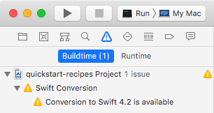
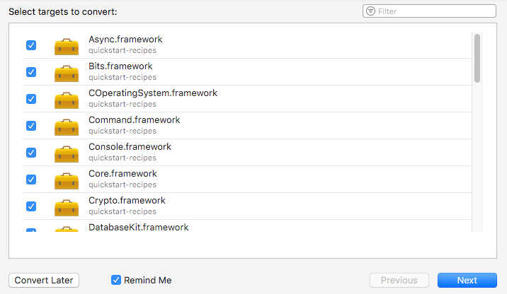
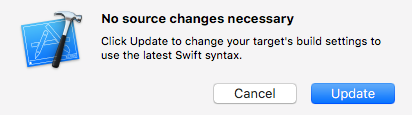
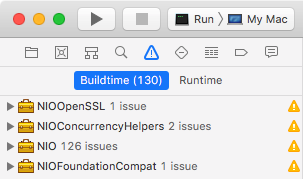
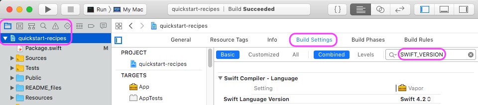
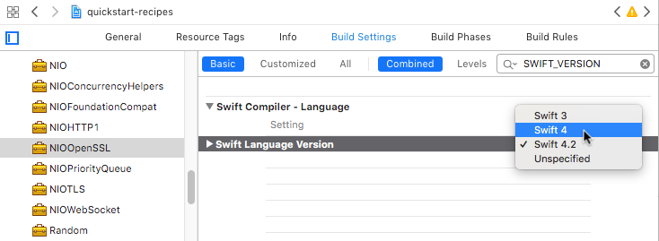
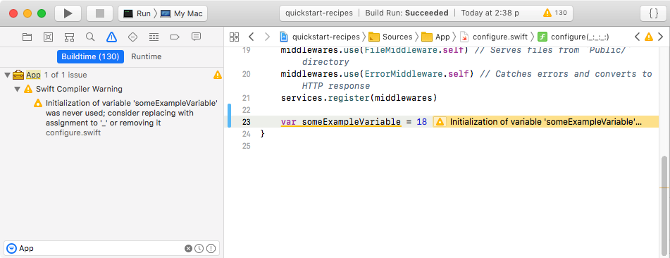

# How to reduce Vapor Xcode _warnings_ clutter

Sometimes external project dependencies cause Xcode compile time warnings. Additionally, Xcode may show warnings when converting to a higher Swift version (e.g. 4 to 4.2) which are not present in a command line `vapor build`.

The example below shows some steps to reduces warnings clutter after a Vapor Xcode project has been generated.

**Step 1. Create a new Vapor project:**

``` bash
vapor new quickstart-recipes --web
cd quickstart-recipes
```

Edit `Package.swift` to set `swift-tools-version` from 4.0 to 4.2 and add `, swiftLanguageVersions: [.v4_2]`.

``` swift
// swift-tools-version:4.2
import PackageDescription
    // ...
        .testTarget(name: "AppTests", dependencies: ["App"])
    ],
    swiftLanguageVersions: [.v4_2]
)

```

Create and open the Vapor Xcode project:

``` bash
# use -y option will automatically reply 'yes'
# to regenerate and open an Xcode project 
vapor update -y
```

**Step 2. Convert Xcode project to Swift 4.2:**

The generated Xcode project recognizes that the dependencies have not yet setup for Swift 4.2. Note the warning  _"Conversion to Swift 4.2 is available"_ in the Issue navigator.



Click on the _"Conversion to Swift 4.2 is available"_ in the Issue navigator.



> **Tip:** The _"Conversion to Swift 4.2 is available"_ can be dismissed by unchecking "Reminder Me", then click "Convert Later". This will leave the dependency builds as-is without conversion to Swift 4.2.

This example proceeds with a press of the "Next" button. In this case, the conversion ended up with "No source changes necessary". To continue the exmple, press the "Update" button.



After the update, the Issue navigator shows 130 warnings and no error. Most warnings are "`@_versioned` has been renamed to `@usableFromInline`" and "`@_inlineable` has been renamed to `@inlinable`"

If not already selected, select the scheme "Run > My Mac".



Notice that all the warnings are contained in four packages: `NIO`, `NIOConcurrencyHelpers`, `NIOFoundationCompat`, and `NIOOpenSSL`.

In the Project inspector select the "Build Settings" tab. Enter `SWIFT_VERSION` the search box.



Use the drop down menu to revert the four packages from `Swift 4.2` to `Swift 4`: `NIO`, `NIOConcurrencyHelpers`, `NIOFoundationCompat`, and `NIOOpenSSL`.



> **Tip:** A build setting of `Swift 4` will not produce the deprecation warnings of the newer `Swift 4.2`.

**Step 3. Focus On Non-Dependency Warnings:**

The filter example below only shows issues for the `App` target. 



> **Tip:** In the Xcode Issue navigator, warnings can be filtered to only show warnings for the target of interest. 
